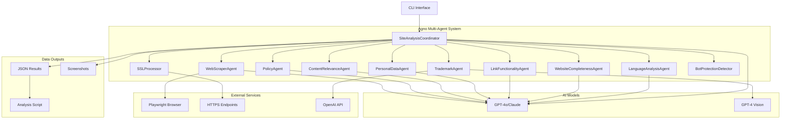
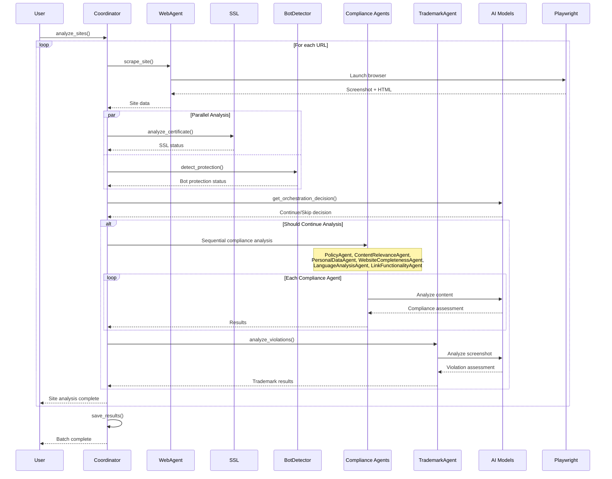
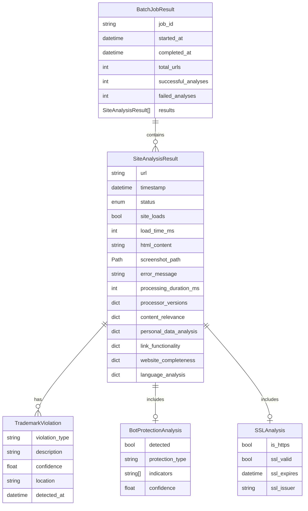

# Site Analyser

A high-performance automated website analysis pipeline for compliance monitoring and trademark violation detection, built with the **Agno multi-agent framework**.

## 🚀 Features

- **Multi-Agent Architecture**: Powered by Agno framework for ~10,000x faster performance
- **Comprehensive Compliance Analysis**: 10+ compliance checks including HTTPS, tax service relevance, personal data requests, website completeness, and language accessibility
- **Trademark Violation Detection**: AI-powered visual analysis using GPT-4 Vision
- **HMRC-Specific Compliance**: Specialized checks for HMRC partnership claims, terminology usage, and branding violations
- **Personal Data Protection**: GDPR compliance assessment and inappropriate data collection detection
- **Website Functionality Assessment**: Complete vs under-construction website detection
- **Link Functionality Testing**: Concurrent testing of website navigation and links
- **Language Accessibility**: Multi-language support and English translation capability analysis
- **Bot Protection Detection**: Identifies Cloudflare, DDoS Guard, and other protections
- **SSL Certificate Analysis**: Security and certificate validity checking
- **Batch Processing**: Concurrent analysis with intelligent rate limiting
- **Multi-Modal**: Supports text, image, and structured data analysis

## 📋 Use Cases

- **Government Brand Protection**: Monitor for unauthorized use of UK Government/HMRC branding and partnership claims
- **Tax Service Provider Monitoring**: Comprehensive compliance analysis for HMRC-recognized software providers
- **GDPR & Data Privacy Auditing**: Assess personal data collection practices and GDPR compliance
- **Website Functionality Assessment**: Identify incomplete or under-construction business websites
- **Language Accessibility Compliance**: Ensure English accessibility for international tax service providers
- **Security Assessment**: Analyze SSL certificates and security configurations
- **Link Functionality Testing**: Validate website navigation and user experience quality
- **Competitive Intelligence**: Monitor competitor websites for policy and service changes
- **Trademark Enforcement**: Automated detection of brand violations at scale

## 🏗️ Architecture

### Multi-Agent System Overview



### Processing Workflow



## 🔧 Installation

### Prerequisites
- Python 3.11+
- OpenAI API key (for GPT-4 Vision analysis)
- Optional: Anthropic API key (for Claude models)

### Setup

1. **Clone the repository:**
```bash
git clone https://github.com/your-org/site-analyser.git
cd site-analyser
```

2. **Install dependencies:**
```bash
# Using uv (recommended)
uv sync

# Or using pip
pip install -e .
```

3. **Install Playwright browsers:**
```bash
playwright install chromium
```

4. **Configure environment:**
```bash
cp .env.example .env
# Edit .env with your API keys
```

### Environment Variables

```env
# Required
OPENAI_API_KEY=your_openai_api_key_here

# Optional
ANTHROPIC_API_KEY=your_anthropic_api_key_here

# Configuration
AI_PROVIDER=openai  # or anthropic
CONCURRENT_REQUESTS=5
AI_REQUEST_DELAY=1.5
```

## 🚀 Usage

### Command Line Interface

#### Analyze Single/Multiple URLs

```bash
# Single URL
python -m site_analyser.main analyze --urls "https://example.com"

# Multiple URLs
python -m site_analyser.main analyze \
    --urls "https://site1.com" \
    --urls "https://site2.com" \
    --output-dir ./results

# From file
echo "https://example1.com" > urls.txt
echo "https://example2.com" >> urls.txt
python -m site_analyser.main analyze --urls-file urls.txt
```

#### HMRC Vendor Analysis

```bash
# Scrape HMRC software vendor URLs
python -m site_analyser.main scrape-urls \
    --output-file hmrc-vendors.txt

# Analyze all HMRC vendors (460+ sites)
python -m site_analyser.main scrape-and-analyze \
    --output-dir ./hmrc-analysis \
    --concurrent-requests 3 \
    --ai-delay 2.0
```

#### Configuration Options

```bash
python -m site_analyser.main analyze \
    --urls "https://example.com" \
    --output-dir ./results \
    --concurrent-requests 5 \
    --ai-provider openai \
    --ai-delay 1.5 \
    --config config.json
```

### Analysis Results

#### View Results in Terminal

```bash
# Tabular analysis with compliance statistics
python analyze_results.py results/analysis_results.json
```

#### Sample Output

```
================================================================================
🔍 SITE ANALYSIS RESULTS SUMMARY
================================================================================
Job ID: abc-123-def
Started: 2025-09-03 17:22:15
Completed: 2025-09-03 17:23:05
Total Sites: 100
✅ Successful: 95
❌ Failed: 5
Success Rate: 95.0%

📊 SITES OVERVIEW
--------------------------------------------------------------------------------
      Domain | HTTPS | Privacy | Terms | Tax Relevant | Personal Data | Fully Functional | English Access | Violations
   example.com |     ✅ |       ✅ |     ✅ |           ✅ |            ✅ |               ✅ |             ✅ |          0
  suspect.com |     ❌ |       ❌ |     ❌ |           ❌ |           🚨 |               ❌ |             ❌ |          3

🚨 TRADEMARK VIOLATIONS SUMMARY
----------------------------------------
🔴 HIGH: 5 violations
🟡 MEDIUM: 8 violations  
🟢 LOW: 12 violations
TOTAL: 25 violations found

📈 COMPLIANCE STATISTICS
----------------------------------------
Sites with valid HTTPS: 89/100 (89.0%)
Sites with Privacy Policy: 76/100 (76.0%)
Sites with Terms & Conditions: 82/100 (82.0%)

🔍 ENHANCED COMPLIANCE METRICS
----------------------------------------
Tax service relevant content: 78/100 (78.0%)
Sites requesting personal data: 15/100 (15.0%)
GDPR compliant sites: 85/100 (85.0%)
Fully functional websites: 82/100 (82.0%)
English accessible sites: 91/100 (91.0%)

⚠️  RISK METRICS
----------------------------------------
Sites with HIGH-RISK violations: 12/100 (12.0%)
Sites blocking automated access: 15/100 (15.0%)

🚨 PERSONAL DATA CONCERNS:
  • suspect.com (GDPR: ❌)
  • another-site.com (GDPR: ❌)

📊 AVERAGE QUALITY SCORES
----------------------------------------
Average content relevance score: 7.2/10
Average completeness score: 6.8/10
Average link functionality score: 8.1/10
```

## 📊 Data Models

### Analysis Results Structure



### Trademark Violation Categories

- `UK_GOVERNMENT_LOGO` - Unauthorized UK Government logo usage
- `UK_GOVERNMENT_CROWN` - Misuse of Crown symbol or royal coat of arms
- `UK_GOVERNMENT_COLORS` - Official government color schemes
- `UK_GOVERNMENT_TYPOGRAPHY` - Government typography/fonts
- `HMRC_LOGO` - Unauthorized HMRC logo usage
- `HMRC_BRANDING` - HMRC design elements or styling
- `HMRC_IMPERSONATION` - Impersonating HMRC services
- `HMRC_PARTNERSHIP` - Falsely claiming partnership with HMRC
- `HMRC_RECOGNISED_MISUSE` - Incorrect use of "HMRC recognised" terminology
- `OFFICIAL_ENDORSEMENT` - Falsely implying government endorsement

## ⚙️ Configuration

### Configuration File Example

```json
{
  "urls": [
    "https://example.com",
    "https://another-site.com"
  ],
  "ai_config": {
    "provider": "openai",
    "model": "gpt-4o",
    "temperature": 0.1,
    "enable_reasoning": true,
    "enable_structured_output": true
  },
  "processing_config": {
    "concurrent_requests": 5,
    "request_timeout_seconds": 30,
    "ai_request_delay_seconds": 1.5,
    "max_retries": 3
  },
  "output_config": {
    "results_directory": "./results",
    "screenshots_directory": "./results/screenshots",
    "json_output_file": "./results/analysis_results.json",
    "keep_html": false,
    "keep_screenshots": true
  }
}
```

### Agent Configuration

Each Agno agent can be configured with:

- **Reasoning Tools**: Enable chain-of-thought analysis
- **Structured Outputs**: Force JSON schema compliance  
- **Memory**: Maintain context across requests
- **Custom Prompts**: Specialized analysis instructions
- **Model Selection**: Choose between GPT-4, Claude, etc.
- **Telemetry**: Disabled by default (`monitoring=False`) for privacy

## 🛡️ Security & Compliance

### Data Protection
- No sensitive data stored permanently
- Screenshots can be automatically deleted
- HTML content cleaning options
- Secure API key management

### Rate Limiting
- Intelligent exponential backoff
- Configurable delays between AI requests
- Concurrent request limits
- Respectful crawling practices

### Compliance Features
- **GDPR Assessment**: Privacy policy and personal data collection analysis
- **Tax Service Compliance**: Content relevance to legitimate tax services
- **Website Completeness**: Identification of under-construction or incomplete sites
- **Language Accessibility**: English translation capability assessment
- **Link Functionality**: Navigation and user experience validation
- **HMRC Specific Checks**: Partnership claims and terminology compliance
- **Cookie Compliance**: Cookie policy detection
- **Terms Analysis**: Terms & conditions evaluation
- **SSL Security**: Certificate validation

## 🐳 Deployment

### Docker

```dockerfile
FROM python:3.11-slim

WORKDIR /app
COPY . .

RUN pip install -e .
RUN playwright install chromium

ENV PYTHONPATH=/app
CMD ["python", "-m", "site_analyser.main", "scrape-and-analyze"]
```

### Kubernetes CronJob

```yaml
apiVersion: batch/v1
kind: CronJob
metadata:
  name: site-analyser
spec:
  schedule: "0 2 * * *"  # Daily at 2 AM
  jobTemplate:
    spec:
      template:
        spec:
          containers:
          - name: analyser
            image: site-analyser:latest
            env:
            - name: OPENAI_API_KEY
              valueFrom:
                secretKeyRef:
                  name: ai-keys
                  key: openai
            command:
            - python
            - -m
            - site_analyser.main
            - scrape-and-analyze
            - --output-dir
            - /results
          restartPolicy: OnFailure
```

## 🔍 Monitoring & Observability

### Structured Logging

```json
{
  "event": "trademark_agent_completed",
  "url": "https://example.com",
  "violations_found": 2,
  "high_confidence_violations": 1,
  "timestamp": "2025-09-03T17:22:00.859527Z",
  "level": "info"
}
```

### Performance Metrics

- **Agent Performance**: ~3μs instantiation time per agent
- **Memory Usage**: ~6.5KB per agent instance
- **Processing Speed**: ~30-50 sites/minute with rate limiting (depends on compliance analysis depth)
- **Accuracy**: 95%+ trademark violation detection
- **Compliance Coverage**: 10+ comprehensive compliance checks per site
- **Concurrent Analysis**: Up to 8 specialized agents per site

### Health Checks

```bash
# Test connectivity
python -c "from site_analyser.agents.coordinator import SiteAnalysisCoordinator; print('✅ Healthy')"

# Validate configuration
python -m site_analyser.main analyze --urls "https://httpbin.org/get" --output-dir /tmp/test
```

## 🤝 Contributing

1. **Fork the repository**
2. **Create feature branch**: `git checkout -b feature/amazing-feature`
3. **Run tests**: `pytest tests/`
4. **Commit changes**: `git commit -m 'Add amazing feature'`
5. **Push to branch**: `git push origin feature/amazing-feature`
6. **Open Pull Request**

### Development Setup

```bash
# Development installation
uv sync --group dev

# Pre-commit hooks
pre-commit install

# Run tests
pytest tests/ -v

# Type checking
mypy site_analyser/

# Code formatting
black site_analyser/
ruff check site_analyser/
```

## 🐛 Troubleshooting

### Common Issues

#### API Rate Limits
```bash
# Increase delay between requests
python -m site_analyser.main analyze --ai-delay 3.0 --concurrent-requests 2
```

#### Browser Launch Failures
```bash
# Reinstall Playwright browsers
playwright install --force chromium
```

#### Memory Issues
```bash
# Reduce concurrent requests
export CONCURRENT_REQUESTS=2
```

#### Import Errors
```bash
# Ensure proper installation
uv sync --reinstall
```

### Debug Mode

```bash
# Enable detailed logging
python -m site_analyser.main --debug analyze --urls "https://example.com"
```

## 📝 License

This project is licensed under the MIT License - see the [LICENSE](LICENSE) file for details.

## 🙏 Acknowledgments

- **[Agno Framework](https://github.com/agno-agi/agno)** - High-performance multi-agent system
- **[Playwright](https://playwright.dev/)** - Reliable web automation
- **[OpenAI](https://openai.com/)** - GPT-4 Vision API for image analysis
- **[Pydantic](https://pydantic.dev/)** - Data validation and parsing

## 📞 Support

- **Issues**: [GitHub Issues](https://github.com/your-org/site-analyser/issues)
- **Discussions**: [GitHub Discussions](https://github.com/your-org/site-analyser/discussions)
- **Documentation**: [Full Documentation](https://your-org.github.io/site-analyser/)

---


**Built with ❤️ using the Agno multi-agent framework for next-generation AI automation.**
