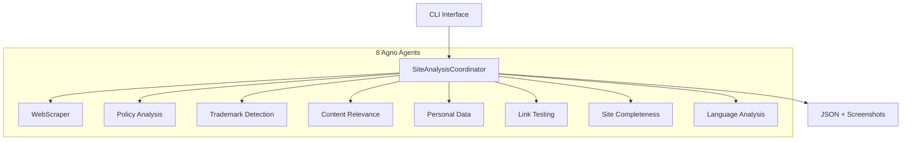

# Site Analyser

A high-performance automated website analysis pipeline for compliance monitoring and trademark violation detection, built with the **Agno multi-agent framework**.

## 🚀 Quick Start

```bash
# Install
uv sync && playwright install chromium

# Configure API keys
cp .env.example .env  # Add your OpenAI/Anthropic API key

# Analyze websites
uv run site-analyser analyze --urls "https://example.com" --output-dir results

# View results  
python analyze_results.py results/analysis_results.json
```

## ✨ Key Features

- **🤖 Multi-Agent Architecture** - 8 specialized AI agents powered by Agno framework
- **🛡️ Comprehensive Compliance** - 10+ compliance checks including HTTPS, GDPR, tax service relevance
- **🎯 HMRC-Specific Monitoring** - Specialized for UK Government/HMRC brand protection
- **🕵️ Bot Evasion** - Advanced stealth techniques to bypass Cloudflare, reCAPTCHA, etc.
- **📊 Detailed Reporting** - Rich analytics with visual compliance indicators
- **⚡ High Performance** - Concurrent analysis with intelligent rate limiting

## 🏗️ System Overview



## 📋 Compliance Checks

| Check | Purpose |
|-------|---------|
| **HTTPS/SSL** | Security certificate validation |
| **Privacy Policy** | GDPR compliance assessment |
| **Terms & Conditions** | Legal documentation presence |
| **Tax Service Relevance** | Content legitimacy for tax providers |
| **Personal Data Collection** | Inappropriate data request detection |
| **Website Completeness** | Under-construction site identification |
| **Link Functionality** | Navigation and UX validation |
| **Language Accessibility** | English translation capability |
| **HMRC Branding** | Unauthorized logo/partnership claims |
| **Bot Protection** | Cloudflare/DDoS Guard detection |

## 🚀 Usage Examples

```bash
# Single site analysis
uv run site-analyser analyze --urls "https://example.com"

# Batch analysis with stealth mode
uv run site-analyser analyze \
    --urls-file urls.txt \
    --stealth \
    --random-agents \
    --human-behavior \
    --concurrent-requests 1

# HMRC vendor analysis
uv run site-analyser scrape-and-analyze --output-dir hmrc-analysis
```

## 📊 Sample Results

```
📊 SITES OVERVIEW
--------------------------------------------------------------------------------
      Domain | HTTPS | Privacy | Tax Relevant | Personal Data | Violations
   example.com |     ✅ |       ✅ |           ✅ |            ✅ |          0
  suspect.com |     ❌ |       ❌ |           ❌ |           🚨 |          3

📈 COMPLIANCE STATISTICS
----------------------------------------
Sites with valid HTTPS: 89/100 (89.0%)
Tax service relevant content: 78/100 (78.0%)
Sites requesting personal data: 15/100 (15.0%)
GDPR compliant sites: 85/100 (85.0%)
```

## 📚 Documentation

- **[Installation & Setup](docs/INSTALLATION.md)** - Detailed installation guide
- **[Configuration](docs/CONFIGURATION.md)** - Settings and customization
- **[CLI Reference](docs/CLI.md)** - Complete command-line guide  
- **[Bot Evasion](docs/BOT_EVASION.md)** - Advanced stealth techniques
- **[Architecture](docs/ARCHITECTURE.md)** - Technical deep dive
- **[API Reference](docs/API.md)** - Data models and structures
- **[Deployment](docs/DEPLOYMENT.md)** - Docker, Kubernetes, CI/CD
- **[Troubleshooting](docs/TROUBLESHOOTING.md)** - Common issues and fixes

## 🛠️ Requirements

- Python 3.11+
- OpenAI API key (GPT-4 Vision) or Anthropic API key (Claude)
- Playwright browsers (`playwright install chromium`)

## 🤝 Contributing

1. Fork the repository
2. Create feature branch: `git checkout -b feature/amazing-feature`  
3. Run tests: `pytest tests/`
4. Submit pull request

## 📝 License

MIT License - see [LICENSE](LICENSE) file for details.

## 🙏 Acknowledgments

- **[Agno Framework](https://github.com/agno-agi/agno)** - Multi-agent system
- **[Playwright](https://playwright.dev/)** - Web automation
- **[OpenAI](https://openai.com/)** - GPT-4 Vision API

---

**Built with ❤️ using the Agno multi-agent framework for next-generation compliance automation.**