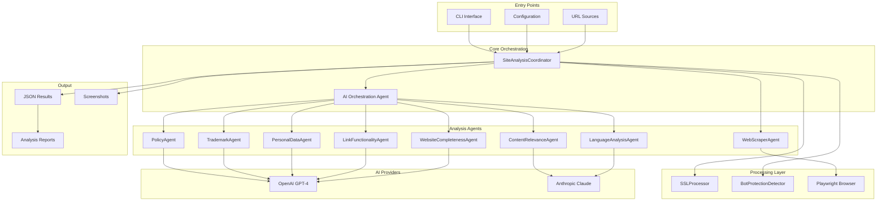
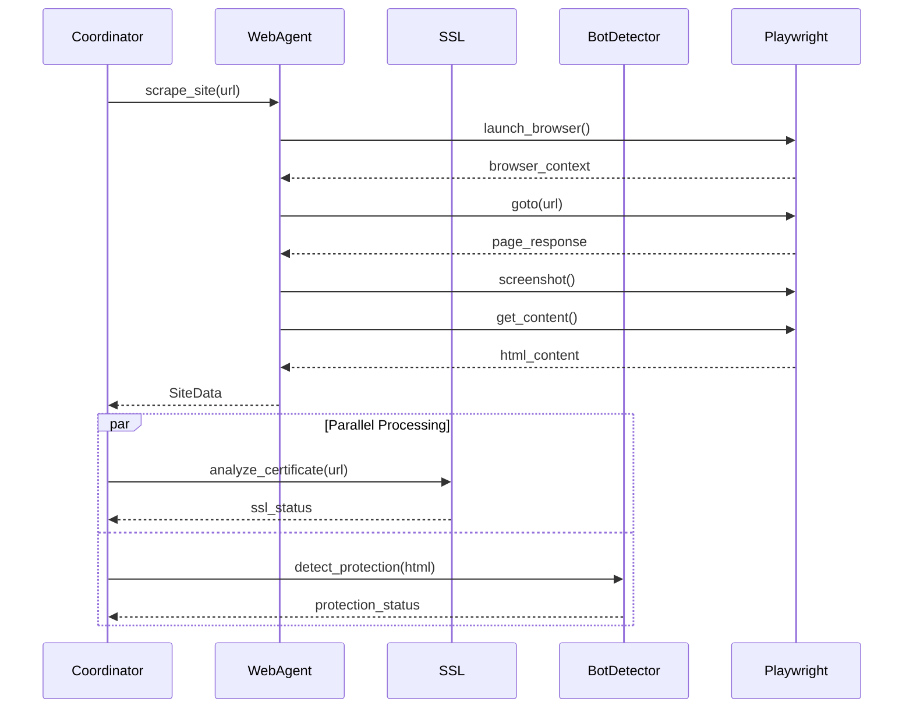
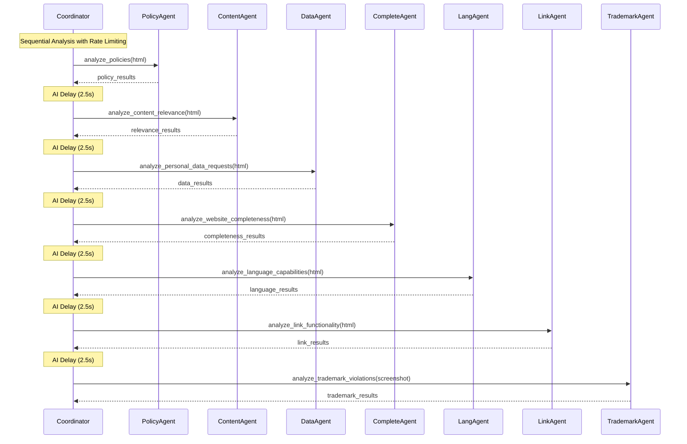

# Architecture Deep Dive

Technical overview of Site Analyser's multi-agent architecture and system design.

## 🏗️ System Overview

Site Analyser is built on a **multi-agent architecture** using the Agno framework, where specialized AI agents collaborate to perform comprehensive website compliance analysis.



## 🧠 Agent Architecture

### Agent Types

**1. Coordinator Agent**
- **Role**: Orchestrates entire analysis workflow
- **Responsibilities**: Agent coordination, decision making, result aggregation
- **Framework**: Agno Agent with reasoning tools

**2. Analysis Agents**
- **Role**: Specialized compliance analysis
- **Count**: 8 agents with distinct expertise
- **Framework**: Agno Agent with structured outputs

**3. Processing Components**
- **Role**: Non-AI processing tasks
- **Examples**: SSL checking, bot detection
- **Framework**: Traditional Python processors

### Agent Specialization

| Agent | Expertise | Input | Output |
|-------|-----------|-------|---------|
| **WebScraperAgent** | Web scraping, screenshot capture | URL | HTML, screenshots, metadata |
| **PolicyAgent** | Legal compliance, GDPR | HTML content | Policy links, compliance status |
| **TrademarkAgent** | Visual trademark detection | Screenshots | Violation classifications |
| **ContentRelevanceAgent** | Tax service legitimacy | HTML content | Relevance scoring, legitimacy flags |
| **PersonalDataAgent** | Data collection assessment | HTML content | GDPR compliance, data requests |
| **LinkFunctionalityAgent** | Navigation testing | HTML + URLs | Link status, functionality scores |
| **WebsiteCompletenessAgent** | Site completion status | HTML content | Completeness scoring, construction flags |
| **LanguageAnalysisAgent** | Language accessibility | HTML content | Language detection, translation capability |

## 🔄 Processing Workflow

### Phase 1: Initial Assessment



### Phase 2: AI Orchestration

```python
async def _get_orchestration_decision(self, url: str, result: SiteAnalysisResult) -> AnalysisOrchestrationResult:
    """AI-driven decision on analysis continuation."""
    decision_prompt = f"""
    Make orchestration decision for: {url}
    
    Current Status:
    - Site loads: {result.site_loads}
    - Has content: {bool(result.html_content)}
    - SSL valid: {result.ssl_analysis.ssl_valid if result.ssl_analysis else "Unknown"}
    - Bot protection: {result.bot_protection.detected if result.bot_protection else "Unknown"}
    
    Should we continue with full compliance analysis?
    """
    
    return await self.coordinator.arun(decision_prompt)
```

### Phase 3: Compliance Analysis



## 🔧 Technical Implementation

### Agno Agent Pattern

```python
class ContentRelevanceAgent:
    def __init__(self, config: SiteAnalyserConfig):
        # Model selection
        if config.ai_config.provider == "openai":
            model = OpenAIChat(id="gpt-4o")
        else:
            model = Claude(id="claude-sonnet-4-20250514")
        
        # Agent creation with structured output
        self.agent = Agent(
            model=model,
            tools=[ReasoningTools(add_instructions=True)],
            instructions="""You are a tax services content specialist...""",
            response_model=ContentRelevanceResult,
            monitoring=False  # Privacy: disable telemetry
        )
    
    async def analyze_content_relevance(self, url: str, result: SiteAnalysisResult) -> SiteAnalysisResult:
        # Structured AI analysis
        analysis = await self.agent.arun(analysis_prompt)
        result.content_relevance = analysis.model_dump()
        return result
```

### Structured Output Models

```python
class ContentRelevanceResult(BaseModel):
    is_tax_relevant: bool
    relevance_score: float
    service_categories: List[str]
    legitimacy_indicators: List[str]
    red_flags: List[str]
    reasoning: str

class PersonalDataAnalysisResult(BaseModel):
    requests_personal_data: bool
    data_types_requested: List[str]
    gdpr_compliant: bool
    consent_mechanisms: List[str]
    data_protection_issues: List[str]
    reasoning: str
```

### Concurrent Processing

```python
async def analyze_sites(self) -> BatchJobResult:
    # Concurrency control
    semaphore = asyncio.Semaphore(self.config.processing_config.concurrent_requests)
    
    async def analyze_single_site(url: str):
        async with semaphore:
            return await self._coordinate_site_analysis(url)
    
    # Process all URLs concurrently
    tasks = [analyze_single_site(str(url)) for url in self.config.urls]
    results = await asyncio.gather(*tasks, return_exceptions=True)
    
    return batch_result
```

## 🎯 Design Patterns

### 1. Agent Specialization Pattern

Each agent has a single, well-defined responsibility:

```python
# ✅ Good: Specialized agent
class TrademarkAgent:
    """Focused on trademark violation detection only."""
    
# ❌ Bad: Generic agent
class GenericAnalysisAgent:
    """Tries to do everything."""
```

### 2. Structured Output Pattern

All agents return structured, typed data:

```python
# ✅ Good: Structured output
response_model = TrademarkViolationResult

# ❌ Bad: Unstructured text
response = "Found violations: logo usage, color scheme..."
```

### 3. Rate Limiting Pattern

Built-in delays prevent API rate limit issues:

```python
# Sequential analysis with delays
if self.config.processing_config.ai_request_delay_seconds > 0:
    await asyncio.sleep(self.config.processing_config.ai_request_delay_seconds)
```

### 4. Error Isolation Pattern

Agent failures don't cascade:

```python
try:
    result = await agent.analyze(content)
except Exception as e:
    logger.error("agent_failure", agent="trademark", error=str(e))
    # Continue with other agents
```

### 5. Configuration Injection Pattern

All components receive configuration:

```python
def __init__(self, config: SiteAnalyserConfig):
    self.config = config
    # Configure based on settings
```

## 📊 Data Flow

### Input Processing

```
URLs → Configuration → Validation → Queue → Concurrent Processing
```

### Agent Pipeline

```
WebScraper → SSL/Bot Detection → AI Orchestration → Sequential Agent Analysis → Result Aggregation
```

### Output Generation

```
Results → JSON Serialization → File Storage → Analysis Report Generation
```

## 🔄 State Management

### Immutable Results

```python
@dataclass
class SiteAnalysisResult:
    """Immutable result object passed between agents."""
    url: HttpUrl
    timestamp: datetime
    # ... fields are set once, never modified
```

### Agent State Isolation

```python
class PolicyAgent:
    """Stateless agent - no shared state between requests."""
    
    async def analyze_policies(self, url: str, result: SiteAnalysisResult) -> SiteAnalysisResult:
        # Fresh analysis every time, no state carryover
        return enhanced_result
```

## ⚡ Performance Optimizations

### 1. Concurrent Scraping

```python
# Multiple sites scraped simultaneously
semaphore = asyncio.Semaphore(concurrent_requests)
tasks = [scrape_site(url) for url in urls]
results = await asyncio.gather(*tasks)
```

### 2. Agent Reuse

```python
# Agents are instantiated once, reused for all sites
class SiteAnalysisCoordinator:
    def __init__(self, config):
        self.trademark_agent = TrademarkAgent(config)  # Reused
        self.policy_agent = PolicyAgent(config)        # Reused
```

### 3. Lazy Loading

```python
# Screenshots only taken if needed
if self.config.output_config.keep_screenshots:
    screenshot_path = await page.screenshot(...)
```

### 4. Selective Analysis

```python
# Skip expensive analysis if site doesn't load
if not result.site_loads:
    logger.info("analysis_skipped", reason="site_not_accessible")
    return result
```

## 🛡️ Security Architecture

### 1. API Key Management

```python
# Keys loaded from environment, never hardcoded
api_key = os.getenv("OPENAI_API_KEY")
if not api_key:
    raise ConfigurationError("API key required")
```

### 2. Input Sanitization

```python
# URL validation
url = HttpUrl(url_string)  # Pydantic validation

# Content truncation
safe_content = content[:MAX_CONTENT_LENGTH]
```

### 3. Error Information Filtering

```python
# Don't expose sensitive information in logs
logger.error("analysis_failed", url=url, error_type=type(e).__name__)
# NOT: logger.error("analysis_failed", url=url, full_error=str(e))
```

## 📈 Monitoring & Observability

### Structured Logging

```python
logger.info(
    "agent_analysis_completed",
    agent="trademark",
    url=url,
    violations_found=len(violations),
    confidence_score=avg_confidence,
    processing_time_ms=processing_time
)
```

### Performance Metrics

```python
# Built-in timing
start_time = datetime.now(timezone.utc)
# ... processing ...
processing_duration = (datetime.now(timezone.utc) - start_time).total_seconds() * 1000
result.processing_duration_ms = int(processing_duration)
```

### Version Tracking

```python
result.processor_versions = {
    "WebScraperAgent": "1.0.0",
    "TrademarkAgent": "1.0.0",
    "PolicyAgent": "1.0.0",
    # ... all agent versions
}
```

## 🔮 Extensibility

### Adding New Agents

1. **Create Agent Class**
```python
class NewComplianceAgent:
    def __init__(self, config: SiteAnalyserConfig):
        # Initialize agent
    
    async def analyze_new_compliance(self, url: str, result: SiteAnalysisResult) -> SiteAnalysisResult:
        # Perform analysis
        return result
```

2. **Update Data Model**
```python
class SiteAnalysisResult(BaseModel):
    # ... existing fields ...
    new_compliance_analysis: Optional[dict] = None
```

3. **Register in Coordinator**
```python
class SiteAnalysisCoordinator:
    def __init__(self, config):
        # ... existing agents ...
        self.new_compliance_agent = NewComplianceAgent(config)
    
    async def _coordinate_site_analysis(self, url: str):
        # ... existing analysis ...
        result = await self.new_compliance_agent.analyze_new_compliance(url, result)
```

### Custom Processors

```python
class CustomProcessor:
    """Non-AI processor for specific analysis."""
    
    def __init__(self, config: SiteAnalyserConfig):
        self.config = config
    
    async def process_with_retry(self, url: str, result: SiteAnalysisResult) -> SiteAnalysisResult:
        # Custom processing logic
        return result
```

This architecture provides a scalable, maintainable, and extensible foundation for comprehensive website compliance analysis using cutting-edge AI agent technology.